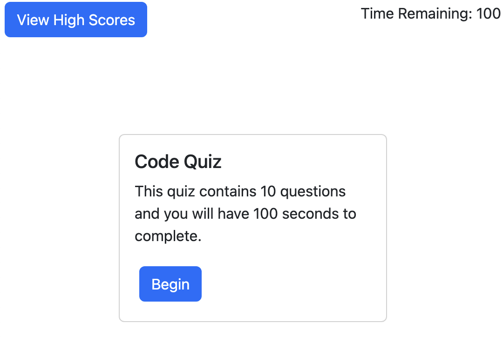

# Code Quiz
### A javascript-based quiz project

This repository is for a quiz project made for my UC Berkeley coding bootcamp. It uses a multiple-choice model and can work for any subject of quiz, but this example page uses a few coding-related questions. There is a high-score leaderboard that saves to local storage only.

The website is live on github pages [and can be viewed here.](https://studiomav.github.io/code-quiz/)

If all is well, the page should display like in this screenshot:

There is no license for this project and it is intended for educational purposes only.